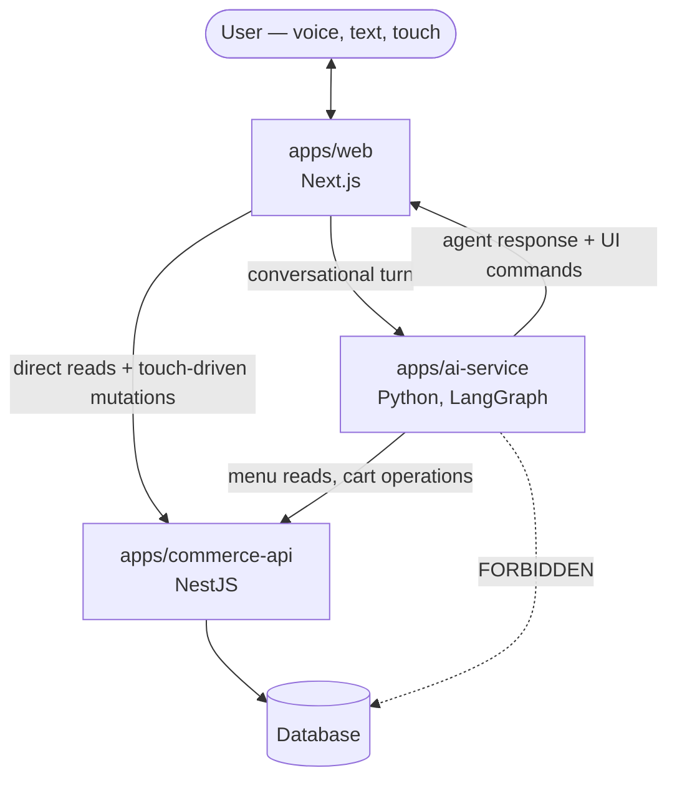

# System Architecture

**Status:** Baseline, established in Phase 0. Describes the *intended* system.
**Last updated:** 2026-09-14
**Related:** [`phase-0-discovery.md`](./phase-0-discovery.md) ·
[`architecture-decisions.md`](./architecture-decisions.md)

> Nothing described here is implemented yet. Every application directory is
> empty. This document exists so that the first line of code written has a
> boundary to respect, rather than a boundary invented after the fact.

---

## 1. Components

| Component | Stack | Owns | Must never |
| --------- | ----- | ---- | ---------- |
| `apps/web` | Next.js, TypeScript | Rendering, voice/text/touch input, cart presentation, UI command execution | Execute AI-generated code; treat agent text as authoritative for price, totals, or availability |
| `apps/ai-service` | Python 3.12, FastAPI (Phase 12, ADR-0019); LangGraph with `langchain-core` (Phase 13, ADR-0020; simulated model, no provider yet) | Conversation state, tool selection, structured intent generation, natural-language explanations | Touch the database; mutate cart or order state directly |
| `apps/commerce-api` | NestJS, TypeScript | Menu, cart, order, pricing, business validation, authorization, idempotency | Depend on conversation history as a source of truth |
| `packages/contracts` | TypeScript (Zod) → JSON Schema → Pydantic | The three schema families below; the shared vocabulary of the system | Contain business logic, runtime behaviour, or transport code |
| Database | PostgreSQL, accessed through Kysely (ADR-0017, Phase 10) | Durable commerce state: menu, carts, orders | Be reachable by anything except `commerce-api` |

## 2. Topology

The dotted line is the boundary that matters most. It is not enforced by
anything mechanical today — no network policy, no credential separation — so
until it is, it is enforced by review.

**Web → API, as built (Phase 11, ADR-0018).** The "direct reads +
touch-driven mutations" edge exists. The browser never calls commerce-api's
origin: it calls `apps/web`'s own `/api/commerce/v1/*`, which Next.js
rewrites to `COMMERCE_API_URL` (server-only). Server Components (the menu)
call `COMMERCE_API_URL` directly. So commerce-api needs no CORS, and all of
`apps/web`'s HTTP goes through one client (`apps/web/src/lib/api/`) that
validates every response against `@contracts/api-contracts`.

**AI → API, as built (Phase 14, ADR-0021).** The "menu reads, cart
operations" edge exists in code. ai-service's agent has five allowlisted
tools. They call `GET /v1/menu`, `GET /v1/cart` and the three
`/v1/cart/items` routes through one client (`apps/ai-service/ai_service/
clients/commerce/`), which is the only code in ai-service that speaks HTTP.
Its base URL is `COMMERCE_API_URL`, and it validates every response against
Pydantic models generated from `api-contracts`. The edge is live only for a
model that calls tools: the simulated model does not, so today it runs in
tests.

## 3. Request walkthrough

A conversational turn, end to end:

1. **User speaks or types** in `apps/web`.
2. **Web forwards the utterance** plus a conversation reference to
   `ai-service`. It does not send cart state — the AI service is not trusted
   to be the source of truth for it.
3. **`ai-service` reasons** (LangGraph), reading menu data from
   `commerce-api` over HTTP as needed.
4. **`ai-service` produces a business intent** — a structured object validated
   against the `agent-intents` schema, e.g. `AddItemToCart { itemId, quantity }`.
5. **`ai-service` submits that intent to `commerce-api`**, which is what
   actually executes it. The AI service asks; it never applies.
6. **`commerce-api` validates and applies** — business rules, pricing,
   idempotency, persistence — and returns the authoritative resulting state.
7. **`ai-service` returns to web**: a natural-language explanation, plus a set
   of **UI commands** validated against the `ui-commands` schema.
8. **Web validates every UI command** against a closed allowlist, discards
   anything unrecognised, and renders the survivors.
9. **Web refetches authoritative state** (cart, totals, order) from
   `commerce-api`. What the user sees as their cart always came from the
   backend, never from the agent's description of it.

**As built (Phase 14).** Steps 3–6 run inside the agent's tool loop. The
agent reads the menu with `get_menu`. It does not submit an `agent-intents`
envelope, because no commerce-api route accepts one. Instead, a write tool
calls the REST route that executes the intent (`POST /v1/cart/items` for
`AddItemToCart`, `PATCH` for `SetCartItemQuantity`, `DELETE` for
`RemoveItemFromCart`), whose body is field-for-field the intent's payload.
commerce-api validates, applies and returns the whole cart, which goes back
to the model as the tool's result. Placing an order is not an agent tool
(ADR-0021). Steps 7–9 (UI commands, refetch) arrive with Phase 15.

A touch interaction skips steps 2–7 entirely: `apps/web` calls `commerce-api`
directly, then refreshes. The AI service is not in the path of a button press.

## 4. The four boundaries

### 4.1 AI service ↛ database

The AI service has no database driver, no connection string, and no
credentials. All data it needs arrives over HTTP from `commerce-api`.

*Why:* the database enforces no business rules on its own. An agent with write
access could produce a cart the commerce layer considers impossible — a
negative quantity, an item priced at zero, an order that skipped validation.

### 4.2 AI service ↛ direct state mutation

The AI service emits intents; `commerce-api` executes them. The AI service
never holds authoritative cart or order state, and its conversation history is
explicitly not a cache of that state.

*Why:* two writers means two truths. When the agent's memory and the database
disagree — and they will, across retries, timeouts and parallel sessions — the
database must be the one that matters.

### 4.3 Frontend ↛ executing AI output

Agent output is untrusted input, not code. Concretely, in `apps/web`:

- Every UI command is parsed against a closed discriminated union. An unknown
  `type` is **dropped and logged**, never forwarded, never rendered.
- No `eval`, no `new Function`, no `dangerouslySetInnerHTML` fed from agent
  output, no dynamic `import()` of an agent-supplied path, no navigation to an
  agent-supplied URL without validation.
- Prices, totals, and availability shown to the user come from `commerce-api`
  responses. The agent may *say* "that comes to $12.50"; the number on screen
  comes from the backend, and the two are allowed to disagree visibly rather
  than have the frontend trust the agent.

*Why:* the agent is an input channel an end user can influence with natural
language. Anything it emits must be treated with the same suspicion as a
query parameter.

### 4.4 UI commands ≠ business intents

Two separate vocabularies, in two separate directories, with a hard rule
between them:

| | Business intent | UI command |
| --- | --- | --- |
| Answers | *What should happen to commerce state?* | *What should the screen do?* |
| Examples | `AddItemToCart`, `RemoveItem`, `ApplyPromotion`, `PlaceOrder` | `ShowMenuCategory`, `HighlightItem`, `OpenCartPanel`, `ShowUpsellPrompt` |
| Executed by | `commerce-api` | `apps/web` renderer |
| Lives in | `packages/contracts/agent-intents` | `packages/contracts/ui-commands` |
| May change cart or order state | Yes — that is its purpose | **Never** |

**The test:** if a UI command could change what the user is charged, it is an
intent wearing a costume. Move it.

*Why:* collapsing the two is the failure that makes every other boundary
decorative. Once the frontend can act on a command that mutates commerce
state, the agent has a write path that skips `commerce-api` validation.

## 5. Authority model

| State | Authoritative source | Everything else is |
| ----- | -------------------- | ------------------ |
| Menu, availability | `commerce-api` | a cache to be refreshed |
| Cart contents, quantities | `commerce-api` | a display of it |
| Prices, totals, discounts | `commerce-api` | never recomputed client-side or agent-side |
| Order status | `commerce-api` | a view |
| Payment state | `commerce-api` | a view |
| Conversation history | `ai-service` | context and explanation only — never state |

When frontend and backend disagree, the backend wins and the frontend
refreshes. This is stated three times in `CLAUDE.md`; it is treated here as
load-bearing rather than advisory.

Since Phase 11 `apps/web` holds to this table in practice, not just on
paper: it shows only commerce-api responses for menu, cart, prices and
orders, computes no price or total, mints no order id, and changes nothing
on screen before the backend has answered (ADR-0018).

## 6. Contracts

`packages/contracts` holds four schema families. Three have exactly one
producer and one consumer pair; the fourth, `common/`, is shared primitives
with no consumer of its own — added in Phase 5 (ADR-0012) so that a menu
identifier, a contract version, or a money amount is defined once rather
than once per family:

| Directory | Produced by | Consumed by | Purpose |
| --------- | ----------- | ----------- | ------- |
| `common/` | — | `ui-commands`, `agent-intents`, `commerce-api` | Shared primitives: contract version, identifiers, quantity, integer-cents money, correlation id, idempotency key, ISO-8601 timestamp, structured error |
| `ui-commands/` | `ai-service` | `apps/web` | What the screen should do |
| `agent-intents/` | `ai-service` | `commerce-api` | What should happen to commerce state |
| `api-contracts/` | `commerce-api` | `apps/web`, `ai-service` | Request/response shapes for the commerce API. First populated in Phase 7 by the Menu domain (`menuResponseSchema`, `menuItemResponseSchema`). `apps/web` validates against it since Phase 11. `ai-service` consumes generated Pydantic models of four of its shapes since Phase 14 |

`commerce-api` (Phase 6) is a real runtime consumer of `common` — its error
model (`docs/api/commerce-api.md` §5/§6) is exactly `common`'s
`ContractError`, and its correlation handling reuses `correlationIdSchema`.
Its dependency on `agent-intents` is a `devDependency` only so far, used by
one test fixture that proves the validation pipeline against a real
contract schema (`test/fixtures/validation-fixture.controller.ts`) — no
intent is executed in production yet, and `agent-intents` becomes a runtime
dependency only once a phase actually executes one.

Both `ui-commands` and `agent-intents` wrap their schemas in an envelope
carrying `contractVersion`, `correlationId`, and `issuedAt` (defined once in
`common/`, spread into each). `ui-commands` batches — one conversational
turn can produce several UI commands, validated in two stages so one
malformed command does not discard its valid siblings (§3, step 7).
`agent-intents` does not batch — one intent per request, each carrying its
own `idempotencyKey`, because each is a distinct state change commerce-api
must apply idempotently on retry.

`apps/web` is additionally restricted, by ESLint
(`no-restricted-imports`), from importing `@contracts/agent-intents` at
all — the same "structural beats asserted" boundary `dispatch.ts` already
holds for `cartStore` (§4.4), now enforced for the whole package rather
than one file. The same technique applies in the other direction (Phase 6,
ADR-0013): `apps/commerce-api` is restricted from importing
`@contracts/ui-commands` or anything under `apps/web` — it executes
business intents, it does not render or produce UI.

Authoring pipeline (ADR-0003): Zod schemas are the source of truth → JSON
Schema is generated → Pydantic models are generated for Python. No schema is
written twice by hand. Every contract package commits its generated JSON
Schema under `schema/*.v1.json`, guarded by a test that regenerates each
artifact in memory and fails if the committed file has drifted — the
enforcement available in the absence of a CI pipeline to run codegen in
(ADR-0012). **Pydantic generation exists since Phase 14** (ADR-0021), for
the four `api-contracts` shapes ai-service consumes: menu, cart, and the
add and update request bodies. `apps/ai-service/scripts/generate_contracts.py`
runs `datamodel-code-generator` over the committed JSON Schema and writes
`ai_service/contracts/api_contracts.py`, which is committed and never edited
by hand. A test regenerates it and fails on drift, the same guard each
contracts package applies to its own JSON Schema. There is still no CI to
run the generator, so the drift test is the enforcement. `agent-intents` and
`ui-commands` are not generated yet: their discriminated unions (ADR-0012)
are answered by the phase that consumes them. The `ContractError` error body
stays a hand-written Pydantic model tested against the committed
`common/schema/error.v1.json`: a scoped, guarded exception (ADR-0019), not
widened.

## 7. Deliberately absent

Per `CLAUDE.md`'s initial scope, and not by oversight: real AI model
integration, real voice provider, real payments, production authentication,
Kubernetes, production infrastructure, distributed tracing, multi-region.

`infrastructure/kubernetes/` exists as an empty directory, and
`infrastructure/database/` is empty too. They should stay empty until a phase
explicitly scopes them, and any work inside them classifies as HIGH risk on
the infrastructure dimension. Phase 10 scoped `infrastructure/docker/` for
one thing only: `compose.yaml`, a local-development PostgreSQL bound to
127.0.0.1 (ADR-0017). It has no API container and no production settings.

## 8. Known architectural gaps

Recorded rather than solved, because solving them is not Phase 0 work:

1. **~~The database is unchosen.~~ Closed in Phase 10.** Early phases
   simulated it (ADR-0004). PostgreSQL now sits behind the same repository
   interfaces, which did not change. Placing an order consumes the cart and
   stores the order in one transaction (ADR-0017).
2. **No mechanical enforcement of §4.1.** The AI service is forbidden from
   reaching the database by convention only. Credential separation or network
   policy would make it structural — appropriate later, premature now. Phase
   10 did not change this. Only `commerce-api` has the driver and
   `DATABASE_URL`, and the local Compose port is bound to 127.0.0.1. There
   is still one database role and no network policy (ADR-0017, deferred).
   Phase 12 made part of it testable. `apps/ai-service`'s
   `tests/test_boundaries.py` fails if a database driver or ORM becomes a
   dependency or is imported, or if a setting is named like a database URL
   (ADR-0019). That is a test, not network or credential separation, so this
   gap stays open.
3. **Idempotency is named but undesigned.** `CLAUDE.md` requires it of
   `commerce-api`; the key strategy and retry semantics are undefined. This
   matters most where the AI service retries an intent after a timeout, which
   is exactly where a duplicate order comes from. Phase 6 reserves HTTP status
   409 for a future idempotency conflict (`docs/api/commerce-api.md` §6) but
   defines no mechanism — this gap is unchanged, not narrowed. Phase 8 made
   it concrete rather than closing it: `POST /v1/cart/items` (the executor
   of `AddItemToCart`) is a delta, so a retried add double-counts, and there
   is still no idempotency-key store (ADR-0015). `PATCH` is idempotent by
   being an absolute set. Phase 8 does use 409, but for an optimistic
   *concurrency* conflict (`CART_CONFLICT`), not for idempotency. Nothing
   retries yet; the first retrying caller has to resolve this gap.
   Phase 9 **narrowed** it for one operation: order creation
   (`POST /v1/orders`) requires an `idempotencyKey`, scoped per owner and
   stored on the order — a retry with the same key and details replays the
   original order, and the same key with different details is 409
   `IDEMPOTENCY_KEY_REUSED` (ADR-0016). That is where the duplicate order
   this gap warns about came from, so that case is closed. The gap stays
   open for everything else, including the cart add above, and the order
   scheme is a precedent rather than a general mechanism.
   Phase 14 made ai-service a caller of that non-idempotent add, without
   closing the gap. Its client never retries, and a write whose response is
   lost is reported to the model as "outcome unknown", with an instruction
   to re-read the cart before anything else (ADR-0021). A model that asks
   for the same add twice still adds twice. An idempotency key on
   `POST /v1/cart/items` is the recorded follow-up, before a real model is
   connected.
4. **Authorization boundaries are named but undesigned.** The system assumes a
   single user for now, so there is no subject to authorize. The shape of this
   changes materially once there is. Phase 6 added no authentication and no
   authorization to `commerce-api` (`CLAUDE.md`'s deferred list); any local
   process can call it. Phase 8's Cart domain resolves cart ownership
   server-side through a `CartOwnerResolver` port whose only adapter
   returns one fixed owner — every caller shares one cart, deliberately,
   rather than trusting an unauthenticated client-supplied id (ADR-0015).
   Authentication replaces that one binding. Phase 9's Order domain
   uses the same binding (its owner resolver delegates to Cart's), so
   there is still exactly one to replace; an order read by id through
   another owner is a 404, but with one owner that is structure, not
   access control (ADR-0016).
5. **`X-Correlation-Id` reaches `commerce-api`'s logs but nothing consumes
   it yet.** Phase 5's open question 3 ("does `correlationId` need to
   survive into commerce-api's own logs?") is now answered — Phase 6's
   `AppLogger` attaches it (and a server-generated `X-Request-Id`) to every
   log line automatically. What is still open: how a caller's own
   `correlationId` (carried inside an `agent-intents` envelope, per
   `docs/api/contracts.md` §3) and the transport-level `X-Correlation-Id`
   header relate when a request eventually carries both — no intent is
   executed yet, so nothing has had to answer this.
   Phase 14 narrowed it: ai-service sends its turn's correlation id to
   commerce-api as `X-Correlation-Id`, so both services' log lines for one
   agent turn share one id (ADR-0021). No intent envelope is sent, so the
   envelope-versus-header question is still open.
